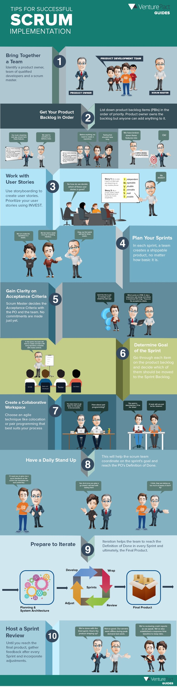

Scrum.
======

Scrum. Es un marco de trabajo a través del cual las personas pueden abordar problemas
complejos adaptativos, a la vez que se entregan productos de forma eficiente y creativa con el
máximo valor.

## Sitio oficial.

[Scrum](https://www.scrum.org/)

	
## Descarga oficial de la guía.

[Guía de Scrum](https://scrumguides.org/)

## Consulta de la guía en línea.

[Guía de Scrum en línea](https://scrumguides.org/scrum-guide.html)
	

## Certificación.

Se pueden certificar en el [Scrum Institute](https://www.scrum-institute.org/)
	
Lean los documentos antes de presentar el examen: 
* [La guía de Scrum (es)](./2017-Scrum-Guide-Spanish-European.pdf)
* [La guía de Scrum (en)](./2017-Scrum-Guide-US.pdf)
* [Scrum Revealed](./Scrum_Revealed_by_International_Scrum_Institute.pdf)

Si desean hacer Scrum de Scrums:
* [Nexus (en)](./NexusGuide v1.1.pdf)

## Test de prueba.

[Test de Scrum master](https://www.scrum.org/open-assessments/scrum-open)

## Donaciones.

Si este material te fue de ayuda puedes donar a mi cuenta de [Paypal](https://paypal.me/FAguirreCardiel)

## Datos de contacto.

Mi nombre es [Federico Aguirre](mailto:opencode@microsoft.com).

## Infografía.

